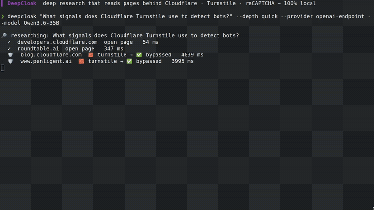

<div align="center">

<h1>🛡️ DeepCloak</h1>

### 남들은 못 읽는 페이지까지 읽는 딥리서치 에이전트.

**Cloudflare · Datadome · Turnstile · reCAPTCHA — 그냥 통과해서 본문을 가져옵니다.**

[](https://github.com/Mrbaeksang/deepcloak/actions/workflows/ci.yml)
[](LICENSE)
[](pyproject.toml)
[](#-ai-에이전트에서-쓰기)
[](CONTRIBUTING.md)
[](https://github.com/Mrbaeksang/deepcloak/stargazers)

[English](README.md) · **한국어** · [简体中文](README.zh-CN.md)

### [▶ 라이브 데모 — deepcloak.vercel.app](https://deepcloak.vercel.app)  ·  [▶ 유튜브로 보기](https://youtu.be/p5ompjDLzaI)

[](https://youtu.be/p5ompjDLzaI)

</div>

---

## 문제

리서치 도구에 질문을 던져요. 근데 좋은 소스 절반은 **봇 차단(Bot Wall)** 뒤에 있어요 — Cloudflare, Datadome, Turnstile, reCAPTCHA. 다른 도구들은 `403` 받고 그 페이지를 조용히 버린 뒤 더 얇은 리포트를 줍니다. **뭘 놓쳤는지도 못 알려줘요.**

## DeepCloak이 하는 일

plain fetch가 봇 차단에 막히면, 그 URL만 **Stealth Fetch로 에스컬레이트**해 벽을 **Bypass(우회)** 하고, 다른 에이전트가 포기한 본문을 회수합니다. 그리고 리포트 끝에 **몇 개의 벽을 뚫었는지** 정확히 알려줍니다.

[`local-deep-research`](https://github.com/LearningCircuit/local-deep-research)(리서치 루프) + [`CloakBrowser`](https://github.com/CloakHQ/CloakBrowser)(스텔스 브라우저) 위의 얇은 로컬 우선 오케스트레이터입니다. **CLI · MCP 서버 · Claude 스킬**로 사용. MIT.

## 🌑 왜 만들었나

열린 웹이 조용히 닫히고 있어요. 좋은 글일수록 봇 체크 뒤로 들어가고, 우리가 점점 믿고 맡기는 AI 리서치 에이전트는 **바로 그 문 앞에서 눈이 멀어요 — 그것도 말없이.** 막힌 소스를 조용히 건너뛴 리포트는 중립이 아니라, 네가 알 수 없는 방식으로 틀린 거예요.

DeepCloak의 입장은 단순해요: **브라우저 든 사람이 읽을 수 있는 건 네 에이전트도 읽을 수 있어야 한다** — 그리고 어떻게 읽었는지 정직해야 한다. 그래서 필요하면 벽을 Bypass하고, 전부 로컬에서 처리하고(쿼리·페이지 안 나감), 넘은 벽을 Evidence Record로 다 보여줘요. 능력 *과* 투명성, MIT, 락인 없음.

## ✨ 뭐가 다른가

|  | 일반 딥리서치 | **DeepCloak** |
| --- | :---: | :---: |
| 열린 웹 읽기 | ✅ | ✅ |
| Cloudflare/Datadome/Turnstile/reCAPTCHA 페이지 | ❌ *조용히 버림* | ✅ **Bypass** |
| 어떤 소스가 막혔는지 알려줌 | ❌ | ✅ Evidence Record |
| 로컬 우선 (API 키 불필요) | ✅ | ✅ |
| 열린 페이지는 빠르게 | — | ✅ *plain 우선, 필요할 때만 스텔스* |

> **라이브 검증 — 목업 아님.** 위 영상은 실제 `deepcloak` 런을 `ffmpeg`로 캡처한 **편집 없는 화면 녹화**(합성 X) — **로컬 LLM(Qwen) + SearXNG, API 키 없음**. Bot Wall마다 Escalate해서 한 번에 **Cloudflare/Turnstile 벽 8개 Bypass**하고 인용 리포트 작성. 전체 클립: [`docs/media/demo-real.mp4`](docs/media/demo-real.mp4), 원본 asciinema 세션도 [`docs/media/demo.cast`](docs/media/demo.cast)에 보관. 열린 웹이 매번 달라서 벽 개수도 런마다 다름(8~20).

## 🚀 빠른 시작

```bash
pip install deepcloak
deepcloak setup                       # 1회: 스텔스 브라우저 내려받기
export OPENAI_API_KEY=...             # 또는 ANTHROPIC_API_KEY / GEMINI_API_KEY — 또는 --provider ollama
deepcloak "Cloudflare Turnstile은 봇을 어떻게 감지하나?" --depth detailed --out report.md
```

인용 포함 `report.md` (끝에 `🛡️ Bypassed N bot-walled sources` 섹션) + `report.md.evidence.json` 사이드카가 생깁니다.

## 🧠 작동 방식

```
검색 (DuckDuckGo, 설정 불필요) ─▶ 후보 URL
        │
        ▼  페이지마다:
   plain fetch ─▶ 봇 차단 감지? ──아니오──▶ 사용 (빠름)
                        │ 예
                        ▼
                  에스컬레이트 ─▶ Stealth Fetch (CloakBrowser) ─▶ Bypass
        │
        ▼
리서치 루프 (local-deep-research) ─▶ 인용 리포트 + Evidence Records
```

스텔스는 무거워서, 먼저 싼 plain fetch를 하고 **봇 차단을 실제로 감지했을 때만** 스텔스 브라우저를 띄웁니다(`--stealth auto`, 기본). `--depth detailed`/`report`가 풀페이지를 가져와 Bypass가 일어납니다.

## 🤖 에이전트에 연결 (MCP)

DeepCloak은 stdio **MCP 서버**로 동작 — `deep_research(query, depth)`, `quick_summary(query)`, `get_evidence(run_id)` 노출.

**Claude Code** — 프로젝트 `.mcp.json`에 추가(예시 파일 레포에 동봉):

```json
{ "mcpServers": { "deepcloak": { "command": "deepcloak", "args": ["mcp"] } } }
```

**Codex** — `~/.codex/config.toml`에 추가:

```toml
[mcp_servers.deepcloak]
command = "deepcloak"
args = ["mcp"]
```

그러면 에이전트가 `deep_research`를 호출해 봇월 막힌 소스까지 직접 읽음. 슬래시 스킬이 좋으면 [`skill/SKILL.md`](skill/SKILL.md)를 `~/.claude/skills/deepcloak/`에.

## ⚙️ 설정

| 플래그 | 기본값 | 비고 |
| --- | --- | --- |
| `--depth` | `detailed` | `quick` / `detailed` / `report` |
| `--engine` | `duckduckgo` | `searxng` / `auto` |
| `--stealth` | `auto` | `always` / `off` |
| `--provider` / `--model` | 자동감지 | `OPENAI` → `ANTHROPIC` → `GEMINI`, 또는 `ollama` |
| `--respect-robots` | 끔 | robots.txt 존중 |
| `--proxy` | — | Stealth Fetch용 SOCKS5 |

## ⚠️ 책임 있는 사용

DeepCloak은 봇 감지를 Bypass합니다. **가져오는 콘텐츠에 접근할 권리는 너의 책임입니다.** robots.txt는 **기본 무시**되며, `--respect-robots`로 존중할 수 있어요 ([ADR-0002](docs/adr/0002-ignore-robots-by-default.md)). 사이트 약관·법을 어기는 데 쓰지 마세요.

## 🛠️ 기반

[`local-deep-research`](https://github.com/LearningCircuit/local-deep-research)(MIT) + [`CloakBrowser`](https://github.com/CloakHQ/CloakBrowser)(MIT), pip 의존 — 코드 벤더링 X. 용어집 [CONTEXT.md](CONTEXT.md), 설계 결정 [docs/adr/](docs/adr/), 기여 가이드 [CONTRIBUTING.md](CONTRIBUTING.md).

## 📄 라이선스

MIT — [LICENSE](LICENSE), [NOTICE](NOTICE) 참고.

<div align="center">

**마지막 도구가 포기한 페이지를 DeepCloak이 읽어줬다면, ⭐ 하나 — 다른 사람들이 찾는 데 도움돼요.**

[](https://star-history.com/#Mrbaeksang/deepcloak&Date)

</div>
