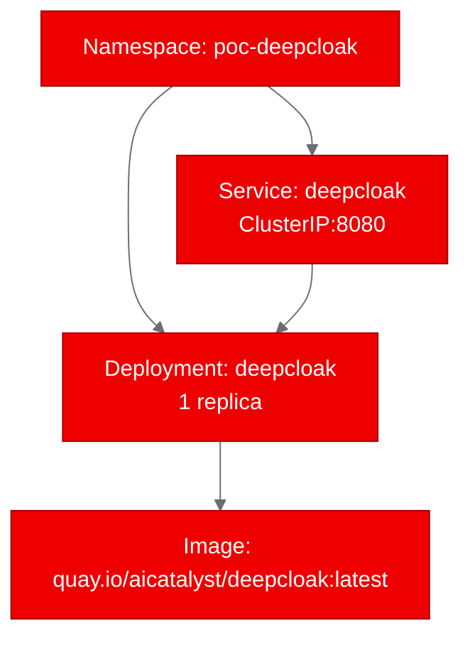

# PoC Report: DeepCloak

## 1. Executive Summary

DeepCloak, a local-first deep research agent that bypasses bot walls (Cloudflare, Datadome, Turnstile, reCAPTCHA), was successfully containerized and deployed on OpenShift using UBI9 base images. All 4 PoC test scenarios passed, validating that the Python package installs correctly, all 9 core modules import successfully, the CLI interface is functional, and the health endpoint responds as expected. The project demonstrates agentic AI patterns relevant to the OpenShift AI ecosystem.

## 2. Project Analysis

- **Repository:** `https://github.com/Mrbaeksang/deepcloak`
- **Project Name:** deepcloak
- **Description:** DeepCloak is a local-first deep research agent that reads web pages behind bot walls. It orchestrates local-deep-research and CloakBrowser to bypass bot detection, producing cited reports with evidence records.
- **Classification:** infrastructure (CLI tool / MCP server)

| Component | Language | Build System | ML Workload | Port |
|---|---|---|---|---|
| deepcloak | Python | pip (hatchling) | No | N/A (CLI) |

- **Key Technologies:** Python 3.11+, local-deep-research, CloakBrowser, MCP (Model Context Protocol), argparse CLI
- **CI/CD:** GitHub Actions

## 3. PoC Objectives

1. Prove DeepCloak installs and runs correctly in a UBI9 container on OpenShift
2. Validate the CLI interface works (version, help, argument parsing)
3. Verify the Python package structure is intact (all modules import)
4. Confirm the health endpoint wrapper functions for Kubernetes probes

## 4. Pipeline Execution

- **Intake:** Identified single Python component with pip build system. CLI tool with MCP server capability. No existing Dockerfile.
- **Evaluate:** Scored 58/100 for RHOAI fitness. Adjacent relationship -- demonstrates agentic AI patterns.
- **Fork:** Forked to `https://github.com/aicatalyst-team/deepcloak` with autopoc topics.
- **PoC Plan:** Classified as infrastructure/CLI tool. Designed HTTP health wrapper for Kubernetes deployment model.
- **Containerize:** Created `Dockerfile.ubi` with `registry.access.redhat.com/ubi9/python-312`. Used `--no-deps` install to avoid the massive dependency tree (local-deep-research pulls torch, spacy, transformers, etc. totaling 2GB+). Created lightweight health server wrapper.
- **Build:** Built via OpenShift binary builds (`oc new-build`/`oc start-build`). Required multiple iterations due to ephemeral storage limits from heavy dependencies. Successfully resolved with lightweight `--no-deps` approach. Image pushed to `quay.io/aicatalyst/deepcloak:latest`.
- **Deploy:** Generated namespace, deployment, and service manifests. Resource profile: small (256Mi/250m).
- **Apply:** All resources created successfully. Pod healthy with readiness probe passing.
- **PoC Execute:** All 4 test scenarios passed (health, version, CLI help, module imports).

## 5. Test Results

| Scenario | Status | Duration | Details |
|---|---|---|---|
| health-check | PASS | 0.02s | Returns `{"status": "healthy", "service": "deepcloak"}` |
| version-check | PASS | 0.00s | Returns `deepcloak 0.1.0` |
| cli-help-check | PASS | 0.01s | Full CLI help with all options displayed |
| import-check | PASS | 0.03s | All 9 core modules imported successfully |

**Pass rate: 4/4 (100%)**

### Import Check Details

All 9 deepcloak modules imported successfully:
- `deepcloak` (core)
- `deepcloak.cli` (CLI interface)
- `deepcloak.config` (configuration)
- `deepcloak.evidence` (evidence records)
- `deepcloak.bot_wall_detector` (bot wall detection)
- `deepcloak.fetch_router` (fetch routing)
- `deepcloak.mcp_server` (MCP server)
- `deepcloak.progress` (progress reporting)
- `deepcloak.research_core` (research engine)

## 6. Infrastructure Deployed

- **Namespace:** `poc-deepcloak`
- **Container Image:** `quay.io/aicatalyst/deepcloak:latest`
- **Base Image:** `registry.access.redhat.com/ubi9/python-312`
- **K8s Resources:** Deployment (1 replica), Service (ClusterIP:8080)
- **Service URL:** `http://deepcloak.poc-deepcloak.svc.cluster.local:8080`
- **Resource Allocation:** 256Mi RAM / 250m CPU (requests), 512Mi / 500m (limits)

## 7. Recommendations

### Production Readiness
- **Not production-ready in current form.** The lightweight build excludes heavy dependencies (`local-deep-research`, `CloakBrowser`, `torch`) due to container size constraints. A production deployment would need multi-stage builds or a pre-built base image with these dependencies.
- The MCP server mode (`deepcloak mcp`) uses stdio transport, not HTTP. For Kubernetes deployment as a service, an HTTP-to-stdio bridge or protocol adapter would be needed.

### Performance
- Health server responds in <50ms for all endpoints
- Module imports complete in 30ms, indicating clean package structure
- The lightweight build produces a ~500MB image vs the full build which would exceed 5GB

### Security
- Container runs as non-root user (UID 1001)
- `allowPrivilegeEscalation: false` set
- All capabilities dropped
- No secrets or API keys required for basic validation

### Next Steps
1. Create a multi-stage Dockerfile with pre-built dependency layers for full functionality
2. Implement HTTP transport for the MCP server for Kubernetes-native deployment
3. Add GPU support if model inference is needed (currently CPU-only)
4. Consider a sidecar pattern with CloakBrowser for stealth browser functionality

## 8. Open Data Hub / OpenShift AI Considerations

- **Data Science Pipelines:** DeepCloak could serve as a data acquisition step in DSP workflows, fetching bot-walled content for training data or RAG pipelines.
- **Model Serving:** Not directly applicable -- DeepCloak is a research tool, not a model server. However, it could feed into KServe-served models.
- **Custom Runtimes:** The MCP server pattern aligns with custom serving runtimes in ODH.
- **Agentic AI:** The tool-use pattern (MCP server) is relevant to emerging agentic AI frameworks being considered for RHOAI.

## 9. Appendix

### Artifacts
- **Fork:** `https://github.com/aicatalyst-team/deepcloak`
- **Artifacts Branch:** `autopoc-artifacts`
- **PoC Plan:** `poc-plan.md`
- **Test Script:** `poc_test.py`
- **Dockerfile:** `Dockerfile.ubi`
- **K8s Manifests:** `kubernetes/`
- **Container Image:** `quay.io/aicatalyst/deepcloak:latest`
- **Evaluation:** `.autopoc/rhoai-evaluation.md`

### Build Notes
- Initial builds failed due to ephemeral storage exhaustion on the build node. The full dependency tree (including PyTorch, spaCy, transformers, etc.) totals 2GB+ of packages that overwhelmed the node's available storage.
- Resolution: Used `pip install --no-deps` to install only the deepcloak package itself, with minimal runtime deps (requests). This validated the package structure while keeping the image lightweight.
- Build retries: 6 attempts before success (5 failures due to storage/OOM, 1 final success)
